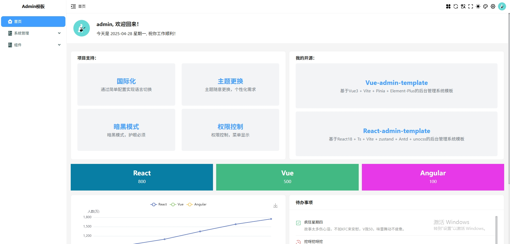

## 运行

```javascript
// 使用pnpm / yarn / npm
pnpm i
pnpm dev
pnpm mock // mock运行, 开启mock接口数据
```
注：node.version > 20; yarn.version = 4.9.1


【登录页】


【首页】

### 文件结构

- public 公共文件
- src
  - api
  * axios.ts 封装axios
  * codeConfig 后端返回错误码
  * index.ts axios常用interface
  * modules 接口文件，可以将接口放入其中
- assets
- icons 放置svg
- images 放置图片
- style 放置less
- components 组件
  - ATable 封装table
  - PageMain layout内使用，主内容大盒子样式
  - svgIcon 在icons放置svg，可在页面使用
    antd icons
    <svgIcon name="ant-design:down-outlined" size={size}/>
    asstes/icons name=(svg文件名)，如：close.svg
    <SvgIcon name="close" size={size}/>
  - config
  - contexts
  - hooks
  - layout
  - mock
  - locales
  - pages
  - router
  - stores
- types 全局接口
- vite
  - alias.ts 配置别名
  * plugins
    - auto-import.ts vite配置自动导入
    - compression.ts vite配置打包压缩
    - icon.ts vite配置icon图标
    - index.ts vite配置插件入口
    - mock.ts 配置mock
    - svg-icon.ts 配置本地svg
